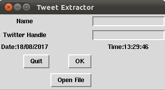
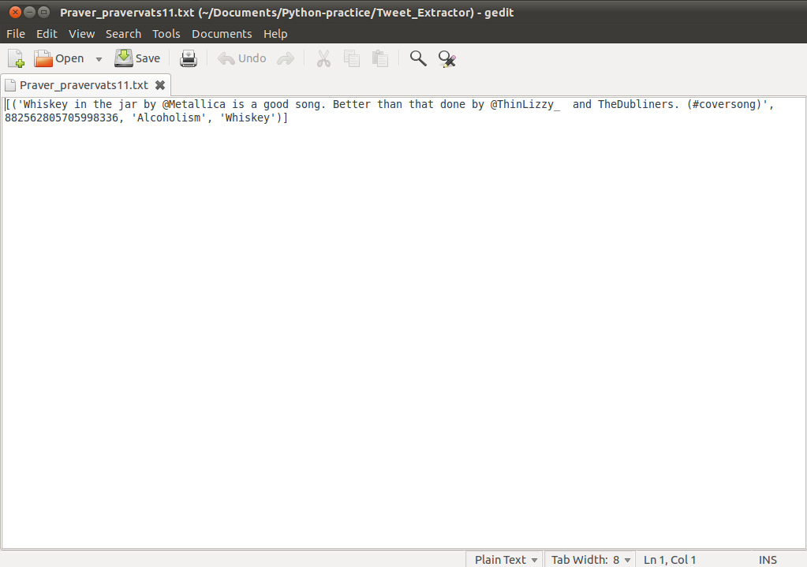

# Tweet_Extrator
Tweet Extractor is a dekstop app on python which sees negative inclinations of the user.

  

Basic UI has also been build for this using Tkinter python library.

  

File with all the relevant tweets looks like this :-  

    

Now working on improving algorithm so that context can also be read for the tweets.  
For that AI is to be added to the app.
